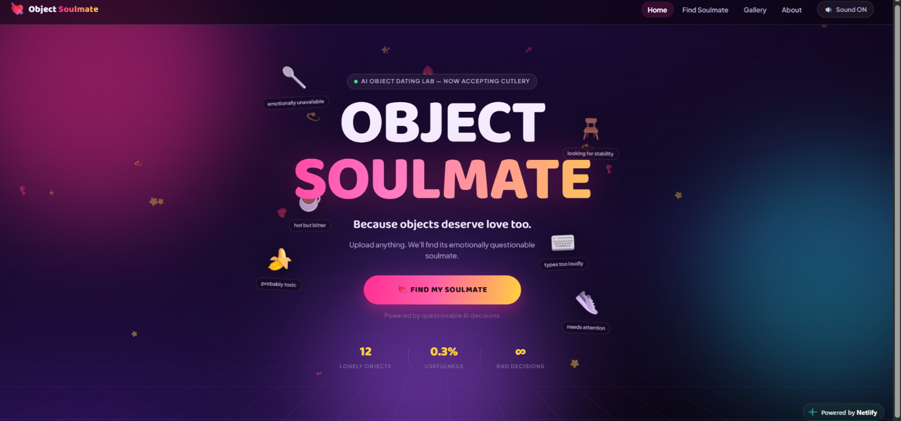
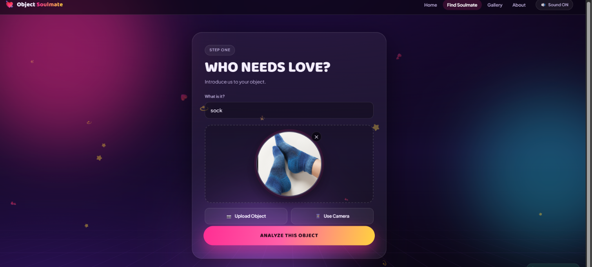
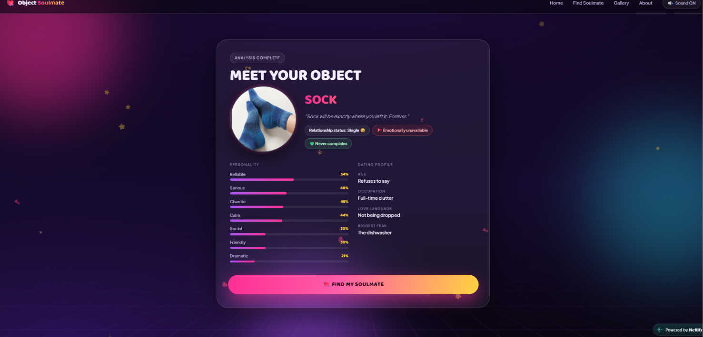
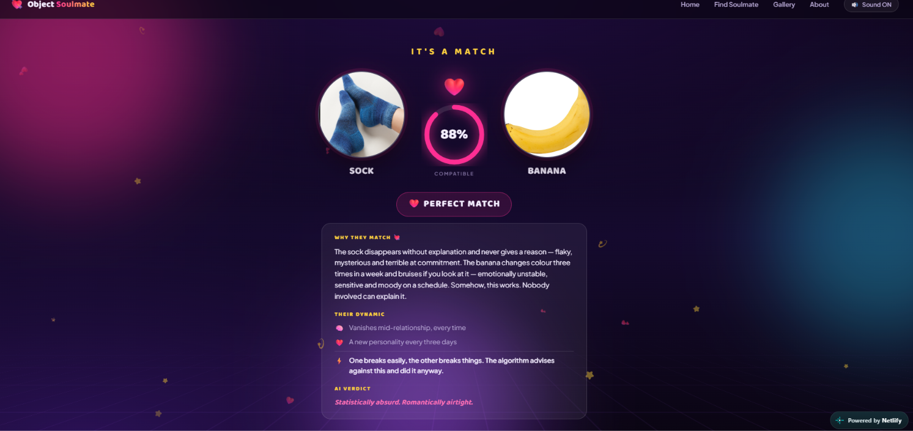
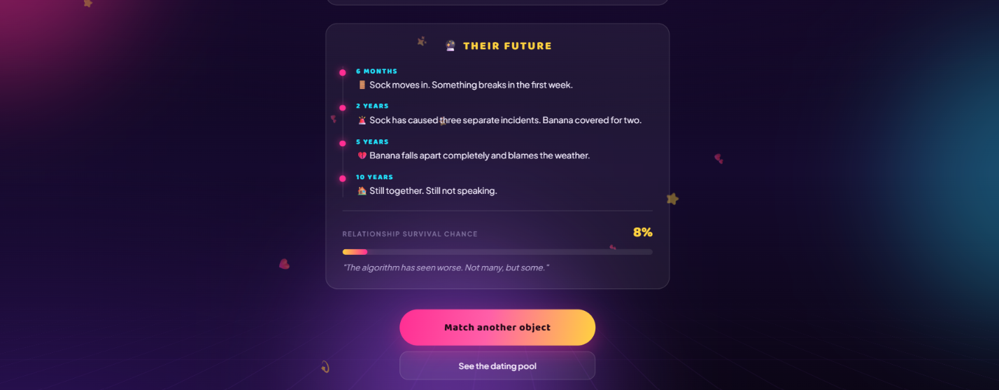
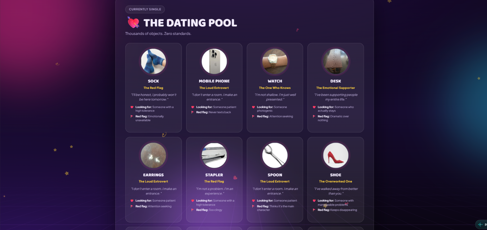
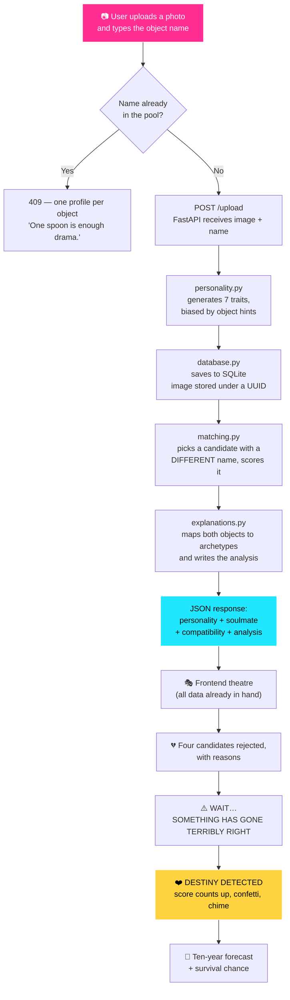

# Object Soulmate 💘

> *Because objects deserve love too.*

### 👉 [**Try it live**](https://object-soulmate-elyra.netlify.app)

*(First load can take up to a minute — the free backend wakes from sleep.)*

## Basic Details

### Team Name: Elyra

### Team Members
- Team Lead: Rahamath Sahala K P - Calicut University Institute of Engineering and Technology
- Member 2: Sreeminnika K N - Calicut University Institute of Engineering and Technology

### Project Description

Object Soulmate is an AI-style dating application for **physical objects**. You photograph a spoon, type its name, and the system gives it a personality, drops it into a dating pool, rejects several unsuitable candidates on its behalf, and matches it with a completely unrelated object — then explains the relationship in far more detail than anyone requested.

It also predicts how the relationship ends. It is never optimistic.

### The Problem (that doesn't exist)

Every single day, billions of household objects sit in drawers, on desks and under sofas, living quietly parallel lives, **completely unaware of one another**.

Your spoon has never met your chair. Your keyboard has no idea your broom exists. They share a home. They share a life. They have never been formally introduced.

Nobody has ever asked the truly important question: **who would your stapler date?**

Worse — objects have *no way whatsoever* of expressing their emotional needs. A banana changes personality three times a week and not one person checks in on it. A chair has silently supported everyone in the house for eleven years and has never once been thanked. This is a crisis nobody is talking about, mainly because it is not one.

### The Solution (that nobody asked for)

We built a **fully functional dating platform for inanimate objects**.

Upload a photo, type what it is, and our backend generates a personality across seven traits. The object gets a dating profile — occupation, love language, biggest fear, green flags, red flags, and a secret it has never told anyone. It then enters the dating pool, where our matching engine evaluates it against every other object that has ever been uploaded.

The matching is not random. Every object is mapped to one of **eight personality archetypes** derived from how humans actually interact with it — a spoon makes noise in every room it enters, therefore it is a loud extrovert; a chair has held everyone up for years, therefore it is emotionally exhausted and reliable. Compatibility comes from how those archetypes collide, which is why *Spoon ❤️ Chair* scores well and the explanation writes itself:

> *"One talks. One listens. Neither has considered swapping."*

Then, because a result appearing instantly would be undignified, we reject four other candidates with reasons, stall dramatically, announce that **SOMETHING HAS GONE TERRIBLY RIGHT**, reveal the soulmate with confetti and a synthesized chime, and finish with a ten-year relationship forecast and a survival percentage that is almost always in single digits.

It solves absolutely nothing. That is the entire point.

## Technical Details

### Technologies/Components Used

For Software:

- **Languages:** Python, JavaScript, HTML, CSS
- **Frameworks:** FastAPI (backend), Uvicorn (ASGI server)
- **Libraries:** `python-multipart` (file uploads), `sqlite3`, `json`, `uuid`, `random`, `shutil` (Python standard library)
- **Frontend:** **Zero frameworks and zero JavaScript libraries** — no React, no jQuery, no animation library. Every animation is hand-written CSS and every sound is generated live with the **Web Audio API**, so there are no audio files to load.
- **Database:** SQLite, with a `UNIQUE` index enforcing one dating profile per object name
- **Tools:** Git, GitHub, VS Code, Live Server, Render (backend hosting), Netlify (frontend hosting)

### Implementation

For Software:

# Installation

```bash
# clone the repository
git clone https://github.com/sahala0408/useless.git
cd useless/backend

# create and activate a virtual environment (Windows)
python -m venv venv
venv\Scripts\activate

# install the three dependencies
pip install -r requirements.txt
```

On macOS/Linux, activate with `source venv/bin/activate` instead.

# Run

```bash
# from the backend/ folder, with the virtual environment active
uvicorn main:app --reload
```

The API starts on `http://127.0.0.1:8000`. On first run it creates `objects.db` and automatically seeds the dating pool with seven starter objects, so it is never empty.

Then open the frontend — in VS Code, **right-click `frontend/index.html` → Open with Live Server**.

> ⚠️ Open the frontend through Live Server, not by double-clicking the file. Camera input is unreliable on `file://` URLs.

### Project Documentation

For Software:

# Screenshots (Add at least 3)


*The home screen. Cartoon objects drift around the title, each labelled with the emotional baggage it brings to the dating pool — "emotionally unavailable", "probably toxic", "looking for stability". Twelve objects are currently single, and the usefulness score holds steady at 0.3%.*


*Step one: introduce your object. You type what it is and add a photo from the camera or the gallery. The photo lands inside a glowing circular character frame rather than a plain rectangle.*


*The generated personality. Seven traits with animated bars and a full dating profile. This sock came out Reliable and Serious, occupation "Full-time clutter", love language "Not being dropped", biggest fear "The dishwasher" — and, inevitably, a red flag of Emotionally unavailable.*


*The soulmate reveal. Sock matched with Banana at 88%, and the relationship analyst explains why using what the objects actually do: "The sock disappears without explanation and never gives a reason… The banana changes colour three times a week and bruises if you look at it."*


*Their ridiculous future. A ten-year forecast built from both objects' personalities — Sock causes three separate incidents, Banana falls apart and blames the weather, and after a decade they are "still together, still not speaking." Relationship survival chance: 8%.*


*The dating pool. Every object ever uploaded, each with an archetype title, a first-person tagline, what it is looking for and its red flag. Clicking any card opens the full profile and reveals who it could realistically date.*

# Diagrams



*The backend does all the real work — personality, matching, compatibility and the written explanation — and returns everything in a single response. The frontend never invents a match; the entire dramatic sequence is theatre performed over data it is already holding, which is why the reveal never stalls waiting on the network.*

### Project Demo

# Additional Demos

- **Live site:** https://object-soulmate-elyra.netlify.app
- **API:** https://object-soulmate-api.onrender.com
- **Repository:** https://github.com/sahala0408/useless

> ⏳ The backend runs on a free tier and sleeps after 15 minutes of inactivity.
> The first request may take up to a minute to wake it — after that it is fast.
> The dating pool seeds itself, so it is never empty.

## Features

| | |
|---|---|
| 📷 **Object upload** | Camera or gallery, on desktop and mobile |
| 🧠 **Personality generation** | Seven traits per object, nudged by per-object hints |
| 💘 **Soulmate matching** | Never matches an object with its own kind |
| 📊 **Compatibility score** | Calculated by the backend, animated on reveal |
| 😂 **Reasoned explanations** | Built from real object behaviour, not random jokes |
| 🚩💚 **Red & green flags** | Every object has both |
| 💭 **Secrets** | Each object is hiding something |
| 💔 **Rejected candidates** | Four other objects turned down, with reasons |
| 🔮 **Future prediction** | A ten-year forecast and a survival percentage |
| 💘 **The Dating Pool** | Browse every object, open its profile, see who it could date |
| 🗑️ **Profile deletion** | With a confirmation the object would object to |
| 🚫 **Duplicate prevention** | Enforced by a database `UNIQUE` index |
| 🔊 **Sound effects** | Generated live with the Web Audio API — no audio files |
| 📱 **Responsive** | Works on phones, with no horizontal overflow |

## Project Structure

```
useless/
│
├── backend/
│   ├── main.py                    # FastAPI app and routes
│   ├── personality.py             # 7-trait personality generation
│   ├── matching.py                # soulmate selection + compatibility
│   ├── explanations.py            # relationship analyst (67 objects, 8 archetypes)
│   ├── database.py                # SQLite storage, duplicate guard, seeding
│   ├── migrate_unique_names.py    # one-off: enforce one profile per name
│   ├── requirements.txt
│   ├── seed/                      # starter objects for an empty pool
│   └── uploads/                   # uploaded photos (not committed)
│
├── frontend/
│   ├── index.html
│   ├── style.css
│   └── script.js
│
├── assets/                        # screenshots for this README
├── index.html                     # redirect into frontend/
├── .gitignore
└── README.md
```

## API Reference

| Method | Endpoint | Purpose |
|---|---|---|
| `GET` | `/` | Health check |
| `POST` | `/upload` | Image + object name → personality, soulmate, analysis |
| `GET` | `/objects` | Everyone currently in the dating pool |
| `DELETE` | `/objects/{id}` | Remove an object from the pool |

## Team Contributions

- Rahamath Sahala K P & Sreeminnika K N: Built the whole thing together — backend, frontend, and every bad decision in between.

## Disclaimer

Object Soulmate is not responsible for broken relationships between household objects. Compatibility scores are generated by a computer that has never been in a relationship. Any resemblance to functioning matchmaking is coincidental and was not intended.

---
Made with ❤️ at TinkerHub Useless Projects


